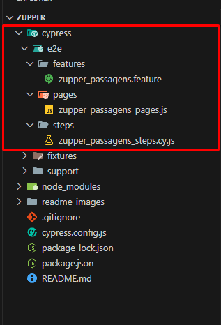
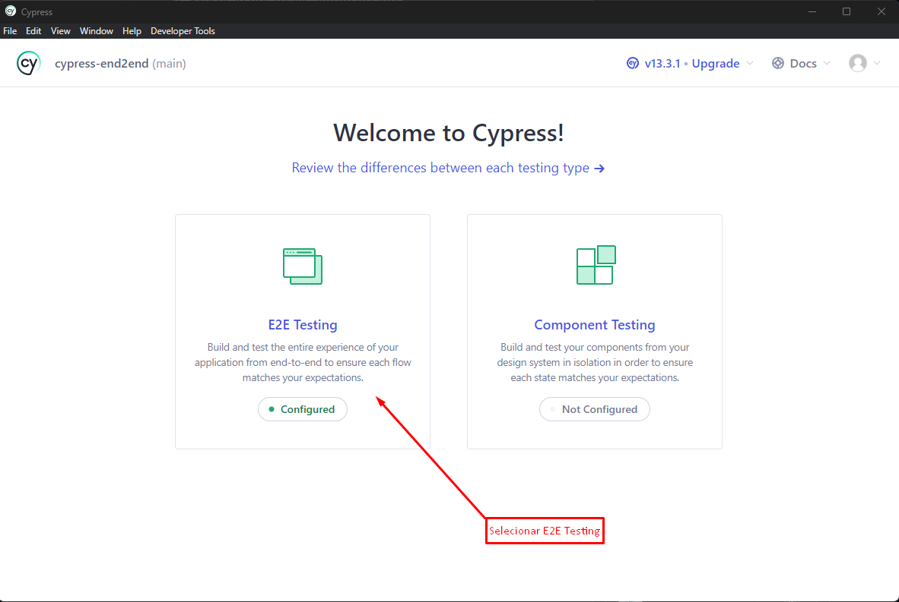
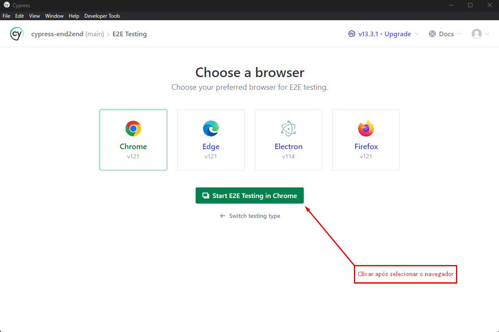
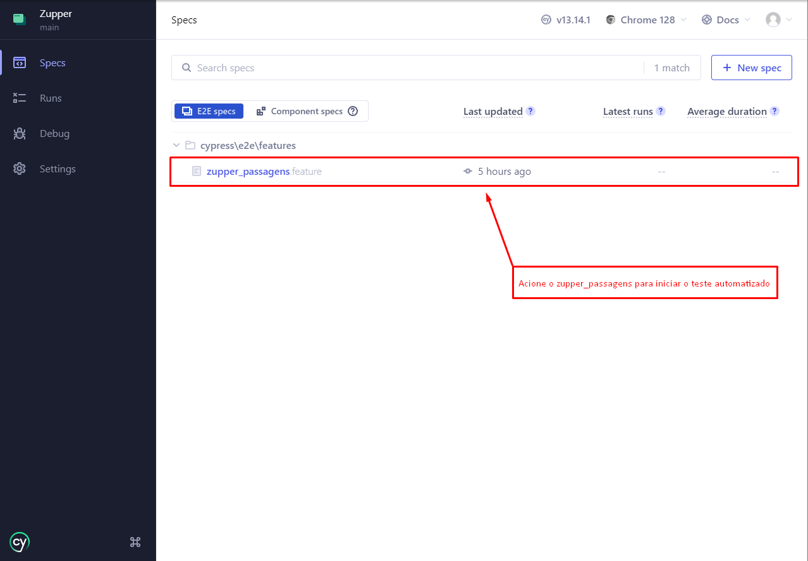

# Zupper

## Tecnologias
* [Cypress](https://docs.cypress.io/guides/getting-started/installing-cypress)
* [Node.js](https://nodejs.org/en)
* [Cucumber](https://cucumber.io/)

## Arquitetura do Projeto


1° Imagem: Arquitetura dos Testes Automatizados.

## PASSO A PASSO PARA EXECUTAR AUTOMAÇÃO

### 1° - É necessário ter as seguintes tecnologias instalados:

* [Cypress](https://docs.cypress.io/guides/getting-started/installing-cypress)
* [Node.js](https://nodejs.org/en)
* [Visual Studio Code](https://code.visualstudio.com/)

### 2° - Clonar o repositório do GitHub:

Para ter acesso ao repositório:
```bash
https://github.com/DG-92/Zupper
```

### 3° Execute o comando
```shell
npm install
```
### 4° Instalação do cucumber
```shell
npm install cypress-cucumber-preprocessor
```
### 5° Instalação do iframe do cypress
```shell
npm install -D cypress-iframe
```

### 6° Abrir o projeto no Visual Studio Code:

Para o desenvolvimento do teste automatizado foi utilizado o Visual Studio Code, no entanto, é recomendado ter a ferramenta instalada na máquina. Caso tenha instalado corretamente, abra o projeto clonado do GitHub.

### 7° Execução dos testes automatizados
Para executar o projeto, é necessário digitar um dos seguintes comandos:

```shell
npx cypress open
```


2° Imagem: Tela apresentada após digitar o comando.


3° Imagem: Tela de seleção de browser, para efetuar E2E testing.


4° Imagem: Apresentação dos testes e2e.

## Dificuldades apresentadas no desafio:

* Iframes ocultos: 
Alguns iframes estavam presentes na automação, o que trouxe complexidade na interação com os elementos da página, como cliques e preenchimento de campos de input.

Ações tomadas para contornar esse problema: Foi criado um código dentro do método index na pasta pages, que remove todos os elementos <iframe> da página. Esse código é útil em situações onde os iframes interferem nos testes, permitindo que outros elementos da página sejam testados sem que os iframes causem problemas. O código implementado é o seguinte:

        cy.document().then(doc => {
            const iframes = doc.querySelectorAll('iframe');
            iframes.forEach(iframe => iframe.remove());
          });

* Aumentar a utilização de ids para seletores: 
Usar IDs nos seletores é essencial para facilitar a automação pois garante que cada elemento tenha uma identificação única na página. Isso simplifica a criação de scripts de testes e automação, pois permite que ferramentas de automação, como Selenium, localizem e interajam com os elementos de forma precisa e eficiente. Além disso, o uso de IDs reduz a chance de erros e ambiguidades, tornando o processo de automação mais robusto e confiável. Em resumo, IDs nos seletores são fundamentais para uma automação mais segura e eficaz.

Observe no inputs de Origem e Destino:
Origem:


Destino:


Não há um seletor especifico para tal, muitas vezes forçando utilizar o Xpath que pode possuir algumas fragilidades:
Complexidade e Legibilidade
Fragilidade
Performance

XPath é considerado uma má prática em testes automatizados porque é frágil, difícil de manter, tem desempenho inferior e requer ferramentas extras no Cypress. Seletores como IDs, classes e atributos de dados são mais robustos e fáceis de usar.

